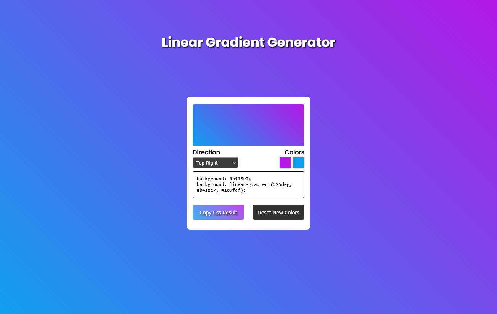

# Linear Gradient Generator

_You can either [click here](https://gregorim04.github.io/linear-gradient-generator/) or the picture above to see the live site._

## With two clicks and a few colors, you can get it.

This simple site lets you pick two colors and set a direction to get CSS for linear gradient property.

### Features :sparkles:

&check; Add your preferred colors.  
&check; Edit any given color using a color wheel.  
&check; Copy the result and use it directly in your component.  
&check; Adjust the direction.  
&check; See the result in real-time.

### Possible Improvements :dart:

- Set a button to add more color options.
- Save previous results.
